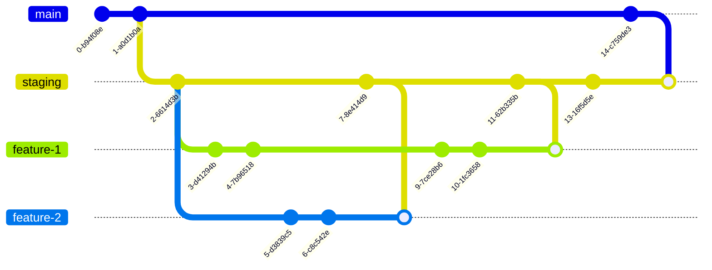

## Tutor Advantage
Tutor Advantage is an innovative educational technology platform designed to revolutionize in-person, after-school English tutoring in Thailand. By combining AI-powered learning tools with an ethical multi-level marketing (MLM) structure, we aim to expand access to high-quality English education beyond urban and upper-middle-class areas.

## Vision and Mission
*Vision*: To make high-quality education available to as many Thai children as possible.
*Mission*: Expand access to quality English education in Thailand through a combination of technology-enhanced learning and in-person tutoring.

## Development
staging: ""
production: ""

### Installation
- Installing package `bun install`
- Running the project `bun dev`

### Deployment
We're using staging and production enviroment for our project. (Every push to the main branch will trigger the deployment process) 

